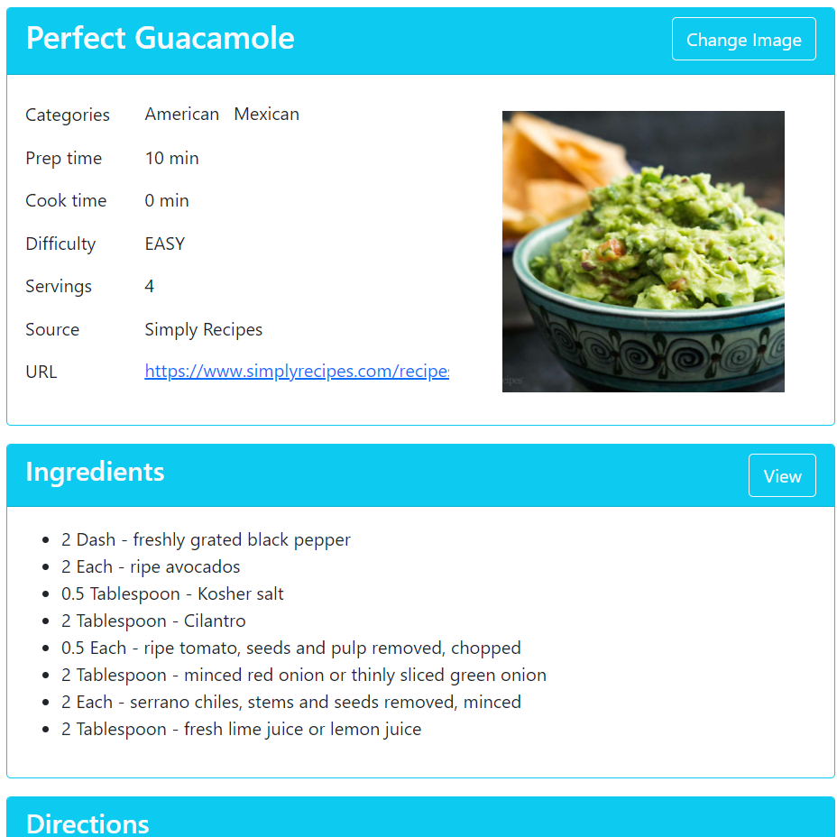

# Web application for recipes
Can store a list of Recipes with the list of Ingredients and Notes. Configured relations between tables (one to one, one to many, many to many). The application was created to learn and demonstrate the functionality of the Spring 5 Framework and Hibernate as part of the course [Spring Framework 5: Beginner to Guru](https://www.udemy.com/course/spring-framework-5-beginner-to-guru/)

## About the application
- **CI/CD** automatically runs tests on **CircleCI** after commit. The current status is 
- Automatically deploys to **Heroku**. You can [Run the application](https://spring5-recipes.herokuapp.com/)
- **IntelliJ IDEA** was used as **IDE** and for work with **Git**
 
## Application features
- Store lists of Recipes, Ingredients, and Notes in the database
- Display this data in a browser
- Ability to run the application in any environment

## Used technologies
- **Java 11** as the main programming language
- **Spring Boot** to set up initial dependencies and to use different profiles
- **Spring Web MVC** to implement Model-View-Controller architecture
- **Spring Data JPA** to easily implement JPA based repositories
- **Hibernate** to map Java POJO's to database tables
- **H2 Database** to store data in-memory
- **CRUD repositories** to read and modify data
- **Commands and converters** to convert data for the presentation layer
- **Maven** to manage dependencies for builds
- **Thymeleaf** to build dynamic pages using templates written in HTML
- **Bootstrap 5** for HTML, CSS and JS templates
- **Lombok** to reduce boilerplate code
- **JUnit 5** and **Mockito** for unit and integration tests