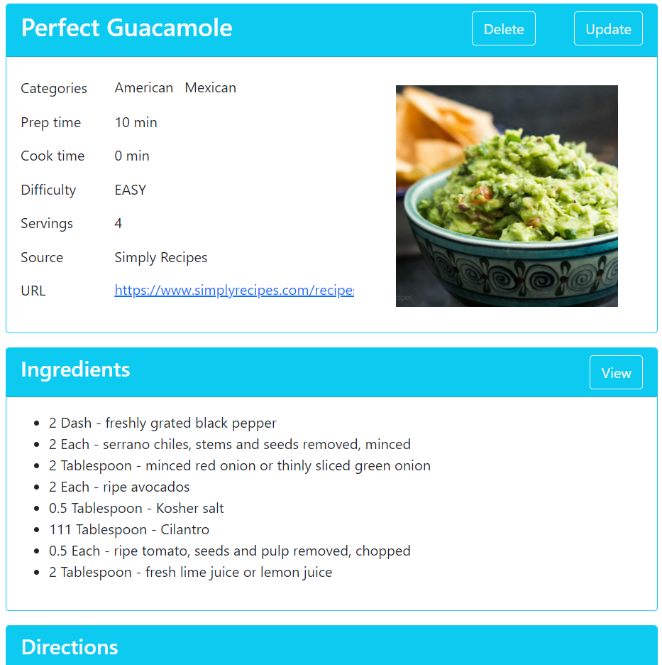

# A simple web application for recipes
Can store a list of Recipes with the list of Ingredients and Notes. Configured relations between tables (one to one, one to many, many to many). The application was created to learn and demonstrate the functionality of the Spring 5 Framework and Hibernate as part of the course [Spring Framework 5: Beginner to Guru](https://www.udemy.com/course/spring-framework-5-beginner-to-guru/)

## Application features
- Store lists of Recipes, Ingredients, and Notes in the database
- Display this data in a browser
- Ability to run the application in any environment

## Used technologies
- **Java 11**. The Core Java features. IntelliJ IDEA was used as IDE.
- **Spring Boot**. Spring initializr to set up dependencies for Maven in the project and the Embed Tomcat webserver to run the application.
- **Spring Data JPA**. Java classes were declared with *@Entity* annotations to map them to database tables. In-memory H2 Database to store the data. CrudRepository class was used to interact with the database.
- **Spring Web**. Spring MVC to implement a widespread MVC model. Spring Model class for the Model component. Simple HTML and CSS with Thymeleaf natural templates were used for the View component. Annotations *@Controller* and *@RequestMapping* were applied for the Controller component to show Spring how to get the data.
- **Lombok**. To reduce boilerplate code
- **Bootstrap** to using CSS for appearance
- **Junit** and **Mockito** for tests